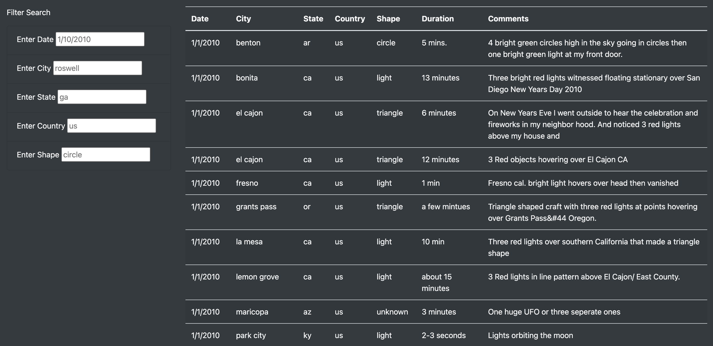

# UFO Sightings Webpage with JavaScript

## Overview
The purpose of this project was to create a webpage displaying a dynamic table of data on UFO sightings. The source for the data table was a [JavaScript array of UFO sightings data](static/js/data.js). The webpage and data table were designed to allow users to filter the UFO sightings by date, city, state, country, and shape. A more detailed overview of the filtering functionality is described below. 

Additional files used to build the UFO sightings webpage can be found here:
-    [JavaScript app file](static/js/app.js)
-    [HTML file](index.html)
-    [CSS style sheet](static/css/style.css)

## Results
When the UFO sightings webpage first loads, the data table includes all sightings from the source JavaScript array, as shown in the image below.

**Unfiltered UFO Sightings Data Table**

 

The table can then be filtered by any combination of date, city, state, country, and/or shape. To filter the table, type the desired filter criteria in the appropriate input box(es) to the left of the table and press enter. If multiple filter criteria are being entered, the table will be filtered by the already entered criteria when the user clicks into the next input box. The image below shows an example of the filtered table after filter criteria have been entered in only the first two input boxes (date and city).

**Partially Filtered UFO Sightings Data Table**

The image below shows an example of the filtered table after filter criteria have been entered in all five input boxes.

**Fully Filtered UFO Sightings Data Table**

 

To return to the unfiltered data table that includes all UFO sightings, the user must delete any filter criteria and press enter.

Note that although the city, state, country, and shape names in the data table and input box placeholders are all lowercase, filter criteria entry is NOT case sensitive (for example, filter criteria can be entered as “Roswell” and “GA” instead of “roswell” and “ga”).

## Summary
A drawback of the current filtering functionality is that the user must delete any previously entered filter criteria and press enter (or click into another filter input box) to return the data table to an unfiltered state. The webpage would be enhanced by the addition of a “Clear Filters” button to clear any filter criteria and reset to the unfiltered data table.

Another limitation of the webpage is that, although the article text and filter input boxes are mobile-responsive, the full data table does not fit on the screen in mobile view and the user must scroll to the right to see the last several columns. The webpage would be enhanced by changing how the data table portion responds for different screen sizes and devices. For example, users might prefer for the size of the data table to be reduced on a smaller screen so that all columns can be viewed and to then be able to click on a row to open a pop-up with that row’s data.

A final recommendation is to add functionality to the data table to allow the user to sort the data in ascending or descending order by the column headers. This would be especially useful if the user were filtering the data table broadly (for example, only by state) and then wanted to see the filtered rows grouped together by city or shape.
